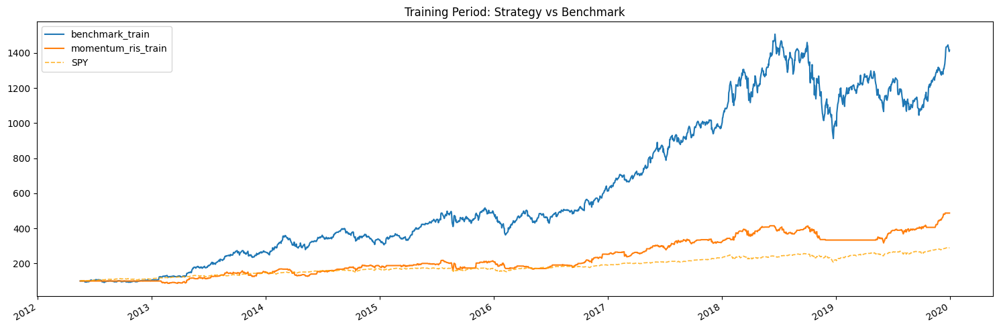
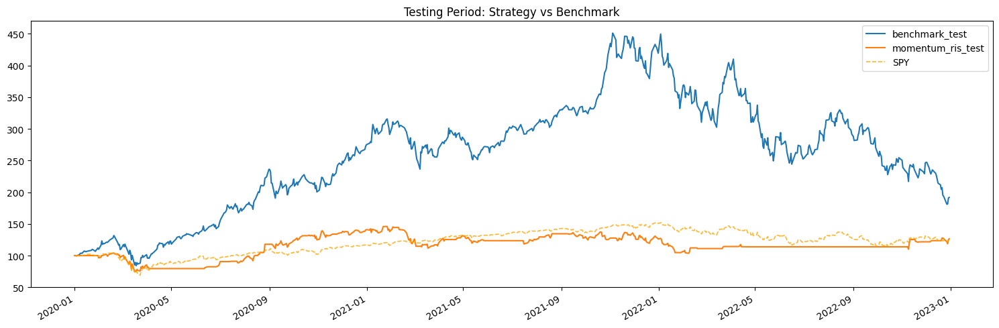
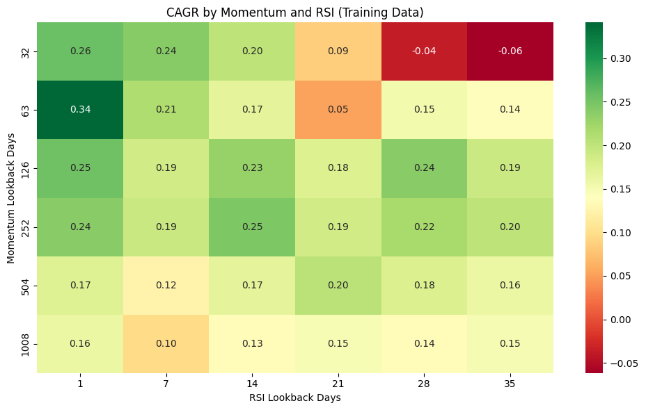
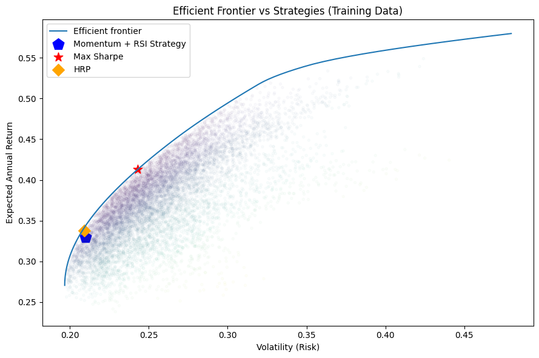

# 📈 Algorithmic Trading in Python
### RSI + Momentum Strategy · Efficient Frontier · Hierarchical Risk Parity


A **quantitative trading research project** that builds, backtests, and evaluates a systematic RSI + Momentum strategy across 6 US large-cap tech stocks from 2012 to 2023. The strategy is validated out-of-sample, benchmarked against SPY and an equal-weight portfolio, and positioned on the Efficient Frontier alongside Max Sharpe and Hierarchical Risk Parity (HRP) portfolios.

> 📊 Companion calculations: [Google Sheets](https://docs.google.com/spreadsheets/d/1UTc6IPuWEgLhRVwyranhKZWKuQd0B2qe/edit?usp=sharing)

---

## 📊 Results

All numbers below come from live notebook execution — not hypothetical projections.

### Training Period — May 2012 to Dec 2019

| Metric | RSI + Momentum | Equal-Weight Benchmark |
|---|---|---|
| **CAGR** | 23.09% | 41.59% |
| **Sharpe Ratio** | 0.98 | 1.35 |
| **Max Drawdown** | −25.09% | −39.47% |
| **Volatility** | 24.27% | 28.89% |
| **Sortino Ratio** | 1.49 | 2.00 |
| **Total Return** | 387.13% | 1,316.23% |

### Test Period — Jan 2020 to Dec 2022

| Metric | RSI + Momentum | Equal-Weight Benchmark |
|---|---|---|
| **CAGR** | 8.15% | 24.29% |
| **Sharpe Ratio** | 0.41 | 0.70 |
| **Max Drawdown** | **−28.95%** | **−59.84%** |
| **Volatility** | 29.21% | 45.98% |
| **Sortino Ratio** | 0.59 | 0.99 |
| **Total Return** | 26.46% | 91.82% |

> **Key insight:** The strategy underperforms the benchmark on raw returns — but it halves the maximum drawdown in both periods. During the 2022 rate-hike crash the equal-weight portfolio fell 59.84%; the strategy fell 28.95%. This is the core trade-off: signal-based filtering sacrifices upside participation in exchange for meaningful downside protection.

### Efficient Frontier Positioning (Training Data)

| Portfolio | Expected Return | Volatility | Sharpe |
|---|---|---|---|
| **Max Sharpe** | 41.32% | 24.31% | 1.70 |
| **HRP** | 33.79% | 20.93% | 1.61 |
| **RSI + Momentum Strategy** | 32.96% | 21.00% | — |

The strategy sits close to the HRP portfolio — similar risk-adjusted positioning without requiring return forecasts. The gap to the frontier quantifies the efficiency cost of using rule-based signals vs mathematical optimisation, a known and accepted trade-off for live implementability.

---

## 📈 Charts

### Strategy vs Benchmark — Training Period (2012–2019)


### Strategy vs Benchmark vs SPY — Test Period (2020–2022)


### Parameter Sensitivity Heatmap — 36 RSI × Momentum Combinations


> A robust strategy shows a **cluster** of strong cells, not a single isolated peak. The default parameters (126-day momentum, 14-day RSI) sit within the consistently green region — confirming they are not overfit to the training period.

### Efficient Frontier with Strategy Positioning


---

## 🧠 Strategy Logic

### Buy signal — both conditions must be true simultaneously

| Condition | Meaning |
|---|---|
| 6-month momentum ≥ historical mean | Stock is in a confirmed uptrend |
| RSI < historical mean | Stock is relatively oversold within that uptrend |

This targets the **pullback within an uptrend** pattern — a high-probability entry for momentum-driven large-caps.

### Sell signal

| Condition | Meaning |
|---|---|
| 6-month momentum < negative mean | Trend has reversed |
| RSI > 60 | Stock has become overbought |

**Position sizing:** equal weight across all qualifying tickers each day. Cash is held when no ticker meets both conditions — the strategy never forces allocation.

---

## 📦 Asset Universe

| Ticker | Company | Role in Universe |
|---|---|---|
| `AAPL` | Apple | Largest cap; persistent trend behaviour |
| `NVDA` | NVIDIA | High momentum; semiconductor supercycles |
| `MSFT` | Microsoft | Defensive growth; lower cyclical correlation |
| `TSLA` | Tesla | High volatility; strong RSI signal testing ground |
| `NFLX` | Netflix | Growth trends with periodic deep corrections |
| `META` | Meta | High-beta; sensitive to sentiment shifts |

Divergent risk profiles (defensive MSFT vs volatile TSLA) let the strategy demonstrate selective signal generation rather than indiscriminate buying.

---

## 🔬 Methodology

```
Data (2012–2023)
     │
     ├── Training (May 2012 – Dec 2019)
     │       ├─ Fit RSI (14-day) + Momentum (126-day) thresholds
     │       ├─ Generate buy / sell signals → daily weight matrix
     │       ├─ bt backtest with 0.5% transaction cost
     │       ├─ 36-parameter grid search → CAGR & Sharpe heatmaps
     │       └─ Efficient Frontier: Max Sharpe + HRP vs strategy
     │
     └── Test (Jan 2020 – Dec 2022)
             ├─ Apply same signal logic out-of-sample (no refitting)
             ├─ bt backtest with same cost assumption
             └─ Compare vs equal-weight benchmark + SPY
```

### Key parameters

| Parameter | Value | Rationale |
|---|---|---|
| Momentum lookback | 126 trading days | ~6 months; captures medium-term trend |
| RSI lookback | 14 days | Standard Wilder RSI |
| Sell RSI level | 60 | Conservative; triggers before overbought extreme |
| Transaction cost | 0.5% per trade | Accounts for bid-ask spread + commissions |

---

## 📓 Notebook Structure

| Section | Content |
|---|---|
| **1 — Data** | Price download via `bt` / `yfinance`; train/test splits |
| **2 — Signals** | 126-day momentum + 14-day RSI; buy/sell logic; daily weight matrices |
| **3 — Backtests** | Active strategy + benchmark across both periods; SPY overlay |
| **4 — Heatmap** | 36-parameter grid: 6 momentum × 6 RSI windows → CAGR & Sharpe |
| **5 — Efficient Frontier** | 10,000 simulations; Max Sharpe + HRP + strategy plotted |
| **6 — Results Summary** | Full metrics table + actionable decision framework |

---

## ⚙️ Setup

### Requirements
- Python 3.10+
- pip

### Install & Run

```bash
git clone https://github.com/ahmeraza/Algorithmic-Trading-in-Python.git
cd Algorithmic-Trading-in-Python
pip install -r requirements.txt
jupyter notebook Algorithmic_Trading_in_Python.ipynb
```

Then: **Kernel → Restart & Run All**

> **PyPortfolioOpt note:** Sections 1–5 run without it. If Section 5 (Efficient Frontier) fails on first install, run `pip install PyPortfolioOpt --upgrade` separately.

### Customise the strategy

| What to change | Location | Example |
|---|---|---|
| Ticker universe | Section 1, `tickers` list | Add `'amzn'` |
| Momentum window | Section 2, `shift(126)` | `shift(63)` for 3-month |
| RSI window | Section 2, `rsi_calc(price, n=14)` | `n=21` for smoother RSI |
| Sell RSI threshold | Section 2, `rsi_df > 60` | `> 70` for later exits |
| Transaction cost | Section 2, `transaction_cost = 0.005` | `0.001` for institutional |
| Date range | Section 1, `start_date` / `end_date` | Extend to `'2025-01-01'` |

---

## 📁 Project Structure

```
Algorithmic-Trading-in-Python/
├── Algorithmic_Trading_in_Python.ipynb   ← Main notebook (12 sections)
├── images/                                ← Chart outputs for README
│   ├── chart_train_comparison.png
│   ├── chart_test_comparison.png
│   ├── chart_heatmap.png
│   └── chart_ef.png
├── requirements.txt
├── CHANGELOG.md
├── .gitignore
└── README.md
```

---

## 📚 Dependencies

| Library | Version | Purpose |
|---|---|---|
| `bt` | 0.2.10 | Backtesting engine, performance stats |
| `yfinance` | 0.2.40 | Market data download |
| `pandas` | 2.2.2 | Data manipulation, time-series alignment |
| `numpy` | 1.26.4 | Matrix operations for Efficient Frontier |
| `matplotlib` | 3.9.0 | All charts |
| `seaborn` | 0.13.2 | Parameter sensitivity heatmaps |
| `PyPortfolioOpt` | 1.5.5 | Efficient Frontier, Max Sharpe, HRP |

---

## 💡 Ideas for Extension

- Add `AMZN`, `GOOGL` or extend to 2024–2025 data
- Replace single train/test split with **rolling walk-forward validation**
- Add a **VIX threshold filter** to suppress signals in high-uncertainty regimes
- Implement **Kelly criterion** position sizing
- Add **Sortino** and **Calmar** ratios to the comparison table (already computed — just surface them)
- Export results to a formatted HTML or PDF report

---

## 📋 Changelog

See [CHANGELOG.md](CHANGELOG.md) for full version history. Latest: **v1.2.0** (2026-04-30)

---

## 📄 License

MIT — free to use, modify, and distribute with attribution.

---

*For educational and research purposes only. Nothing here constitutes financial advice. Past performance does not guarantee future results.*
